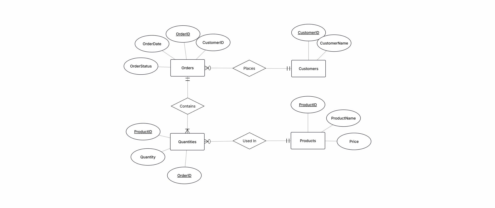

# Ecommerce-Order-Manager-Project

## Instructor:
Dr. Hung Tran - DATCOM lab\
https://fda.neu.edu.vn/fda-members/ts-tran-hung/

## Team members:
1. Nguyen Dinh Thang
2. Bui Tuan Anh
3. Pham Quang Vu

All members are majoring in Artificial Intelligence of Faculty of Data Science and Artificial Intelligence, National Economics University, Vietnam.\
https://fda.neu.edu.vn/nganh-tri-tue-nhan-tao/

## 1. Description
### 1.1.Real-world problem
The shop currently stores orders in a single, unnormalized table. This leads to redundancy, update anomalies, and inconsistent reports. You will normalize to 3NF and build an application used by staff to manage customers, products, orders, and order items, run operational queries, and summarize revenue.
### 1.2.What the project does
This project is a database application designed to manage customers, products, orders and quantities. It includes a fully normalized database schema up to Third Normal Form (3NF), an Entity–Relationship Diagram (ERD), and a complete set of SQL queries for data manipulation and retrieval.
In addition, a graphical user interface (GUI) was developed to enable users to interact with the database more intuitively, including viewing data tables, inserting new records, updating existing information, and performing filtered searches.

The project demonstrates the full workflow of database design and implementation—from conceptual modeling to functional testing—ensuring data integrity, consistency, and usability. Despite some remaining display issues in the GUI, all core features operate correctly and reliably.

## 2. Entities & CRUD screens
Provide GUI screens for:
-	Customers (CustomerID, CustomerName)

-	Products (ProductID, ProductName, Price)

-	Orders (OrderID, CustomerID, OrderDate, Status)

-	Quantities (OrderID, ProductID, Quantity)

CRUD & validation:
- Create/list (paged table)/edit/delete.
- Validation:
  
    • Required fields not empty; Price and Quantity must be numeric and positive.
  
    • OrderDate is a valid date; Status in allowed set (e.g., Pending/Shipped/Delivered).
  
    • Prevent duplicate lines for the same {OrderID, ProductID} unless explicitly supporting line-merging.

## 3.Features
- CRUD for Products, Customers, Orders

- Form validation (required fields, numeric checks, valid dates, allowed statuses)

- GUI built with your chosen framework

- Relational schema normalized up to 3NF

- SQL queries for reporting

- Search, filters

## 4.ERD

## 5.Database Schema

## 6. Some screenshots of GUI

## 7.Installation
First, download and extract the project, then provide DB_HOST, DB_USER, and DB_PASS in the .env file (remove the .example extension). Then run 4 file procedures.sql in the db/procedures. After that, run the main.py file. If it doesn't work, you can move main.py out of the “app” folder and run it again.

## 8. Limitations
- Basic GUI: The interface is functional but lacks advanced UX features (dynamic filtering, input validation, consistent design).

- Passive Database Layer: No triggers, stored procedures, or built-in business logic; all processing relies on the application layer.

- No Security Framework: Missing authentication and authorization, making the system unsuitable for sensitive data.

- Academic Scope: Required knowledge exceeds a typical term project; limited understanding restricts deeper analysis.

## 9. Future Improvements
-	Add login system
-	Add full reporting dashboard
-	Improve UI/UX
